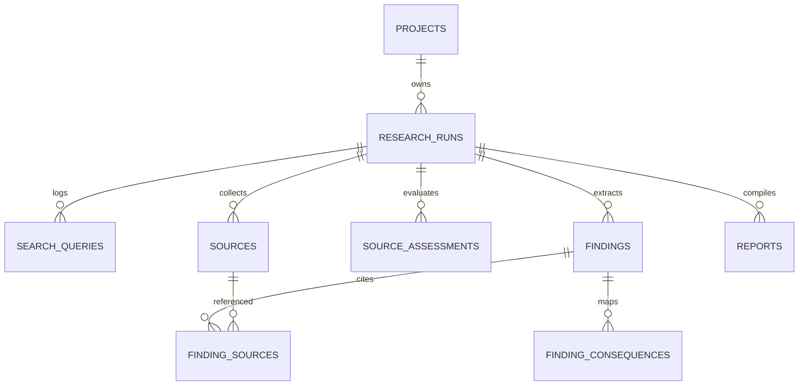

# Mimir 🔍

Mimir is an **intelligent, privacy-focused research and evidence engine** that runs entirely on your own hardware. It is built to turn initial project goals and problems into detailed research plans, gather/deduplicate sources from diverse adapters, run structured reasoning loops, and synthesize versioned research reports with verified, trace-level source citations.

---

## ✨ Key Features

- 💼 **Structured Project Workspace:** Manage multiple projects, define problem goals, track research runs, and maintain report histories.
- 🔄 **Core Research Loop State Machine:** Automatically analyze project aims, map terminology tags, plan query tracks, and perform up to three rounds of source collections.
- 🌐 **Diverse Research Adapters:**
  - **SearXNG:** Broad web research and crawling.
  - **OpenAlex:** Academic literature metadata and abstract reconstruction.
  - **GitHub API:** Repository searches capturing stars, languages, README previews, and release logs.
- 🛡️ **Evidence and Source Integrity:**
  - Strict source classification into `verified_source_content`, `search_snippet`, or `metadata_only`.
  - Excerpt verification validating that quotes actually appear in the downloaded source.
  - Auto-coercing source relationships to ensure search snippets cannot claim to be verified supports/contradicts citations.
- 📑 **Report Versioning:** Synthesize markdown reports with version numbers, active flags, and detailed source metrics. Easily select and activate active versions.

---

## 🛠️ Installation & Setup

Mimir is built using **Next.js** (Frontend & API handlers) and **SQLite** (via Drizzle ORM) for database storage.

### Prerequisites

- **Node.js** (v22.19.0 recommended)
- **Yarn** package manager
- **Ollama** (for local model inference) or cloud model API keys

### Local Installation Steps

1.  **Clone the repository:**
    ```bash
    git clone https://github.com/Aero-area/Mimir.git
    cd Mimir
    ```

2.  **Install dependencies:**
    ```bash
    yarn install
    ```

3.  **Setup environment file:**
    Copy `.env.example` to `.env` and configure variables.

4.  **Start the development server:**
    ```bash
    yarn dev
    ```
    The application will automatically run pending migrations on startup and launch at `http://localhost:3000`.

---

## ⚙️ Configuration & Priority

Mimir consolidated environment configuration resolves with the following priority order:
1.  **Environment Variables:** Set at runtime (overrides other settings).
2.  **Local config.json:** Configuration stored in `data/config.json`.
3.  **UI Settings:** Configurations modified by the user directly in the application interface.

### Available Keys in `.env.example`
- `DATA_DIR`: Directory where configuration and database files are stored. Defaults to `.`.
- `SEARXNG_API_URL`: URL to the SearXNG search engine instance (e.g. `http://localhost:4000`).
- `OLLAMA_BASE_URL`: Base URL to local Ollama inference service (defaults to `http://localhost:11434`).
- `GITHUB_TOKEN`: Optional developer token to prevent rate limiting during collection loops.
- `NVIDIA_API_KEY`: NVIDIA NIM API key for cloud model inference (required if using NVIDIA NIM provider).
- `NVIDIA_BASE_URL`: Base URL for the NVIDIA NIM endpoints (defaults to `https://integrate.api.nvidia.com/v1`).

---

## 🤖 NVIDIA NIM Integration

Mimir supports chat completions via NVIDIA NIM cloud endpoints using an OpenAI-compatible endpoint.

### Configuration
1. Obtain an API key from [build.nvidia.com](https://build.nvidia.com).
2. Set the key locally by adding `NVIDIA_API_KEY` to your local `.env` file.
3. Optionally configure `NVIDIA_BASE_URL` if using a custom endpoint.

> [!WARNING]
> **API Key Security:** Never commit your `.env` file or API keys to versions-controlled repositories.

### Privacy Notice & Limitations
- **External Cloud Processing:** NVIDIA NIM is an external cloud endpoint. Trial usage may log input and output data. Do not use this provider for confidential, personal, or sensitive projects.
- **Sensitive Projects:** For sensitive or offline projects, we strongly recommend using a **local Ollama** setup.
- **Verified Models:**
  - `nvidia/nemotron-3-nano-30b-a3b` — Fast analysis, classification, query refinement, and smaller JSON outputs.
  - `nvidia/nemotron-3-ultra-550b-a55b` — Heavy research, long contexts, and report compilation.
- **Known Limitations:** Embedding models and vision/video specializations are not supported under the NVIDIA NIM provider in this version.

---

## 📂 Datamodel & Architecture

Mimir maintains the following SQLite database tables:



### Table Schema Definitions

- **`projects`**: Tracks workspace id, title, description, and status.
- **`research_runs`**: Stores query targets, execution state (`draft`, `analyzing`, `completed`), and plan metadata (terminology tag maps, rounds).
- **`search_queries`**: Logs queries issued by each adapter, source types, and execution status.
- **`sources`**: Normalizes and saves collected sources with title, URL, canonical URL, provider, type, and parsed metadata.
- **`source_assessments`**: Stores quality profiles (direct relevance, original source, publication status, method transparency, recency).
- **`findings`**: Claims and facts extracted from research run kildes.
- **`finding_consequences`**: Maps how findings affect project options, risks, initial assumptions, and required validations.
- **`reports`**: Holds generated markdown documents, summaries, model metadata, and version tags.

---

## 🛡️ Evidence & Integrity Rules

To prevent model hallucinations, Mimir enforces strict verification checks during claim extraction:

| Source Type | Content Class | Allowed Relations | Excerpt allowed? | Location allowed? |
| :--- | :--- | :--- | :--- | :--- |
| Repository / Full Text | `verified_source_content` | `supports`, `contradicts`, `context`, `mentions` | Yes (verified against full text) | Yes |
| Web search snippet | `search_snippet` | Coerced to `context` or `mentions` | No (forced `null`) | Yes |
| Paper metadata only | `metadata_only` | Coerced to `mentions` | No (forced `null`) | No (forced `null`) |

---

## 🧪 Testing

### Automated E2E Scenario Test
Mimir includes a complete automated E2E Release Scenario test validating the integrity pipeline, persistency across server runs, version switching, and cascade deletions.

Run the scenario test:
```bash
yarn test:scenario
```

---

## ⚠️ Known Limitations

- **Linting command (`yarn lint`):** Next.js 16 CLI does not support standard lint execution within this sandbox configuration.
